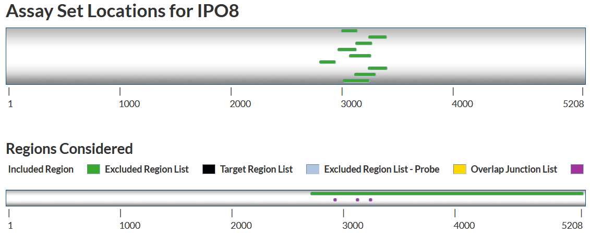

qPCR primer and probe design for IPO8.
This is based on GRCh38.p14.

# Introduction
IPO8 is a housekeeping gene that is expressed in human cells. It is on chromosome 12. 

# Primer probe design
## 1.
First search for IPO8 in NCBI gene database. The result can be find [here](https://www.ncbi.nlm.nih.gov/gene/10526). 
## 2.
From the result, we can see there are two curated isoforms. NM_006390.4 is the one used for MANE project. A shorter one is NM_001190995.2. They share the same exons starting from the 6th exon in NM_006390.4. We can run Primer-Blast on NM_006390.4 with "RefSeq mRNA" in homo sapiens as our database. Make sure to check "Allow primer to amplify mRNA splice variants" so that the other isoform can also be included.

From the result, we can see that all primer pairs are located on the last 4 exons. We will use those as an input to IDT Primer Quest.

## 3.
Download exon sequences. In the graphic view, put the cursor on the transcript NM_006390.4, and click under "Donwload FASTA:"
- NM_006390.4
- NM_006390.4 exons (Optional. We can view the sequence junctions in the graphical view of this specific transcript)

## 4.
Open IDT primer quest, fill in the mRNA sequence. Under Custom Design Parameters, set design parameters for qPCR (2 Primers + Probe). Then change the parameters:
- Reuslts to return: 10
- Primer GC %: 40-60. Opt = 50
- Probe GC %: 30-80. Opt = 50
- Amplicon size: 75-250. Opt = 120
- Min Overlap on 3' end of Primer: 3
- Min overlap on 5' end of Primer: 6
- Included region: 2712-5208
- Overlap Junction List: 2917, 3121,3238 (fill in positions according to exons)

Note that we don't change primer Tm here as IDT estimation is usually a bit higher than Primer Blast, so keeping the default should be fine.

## 5.
Click "GET ASSAYS" and we can see the results. Click **SHOW CUSTOM TARGET REGIONS** and we can see the primer overlap with the junctions:

Click "DOWNLOAD ASSAYS" and we can examine the primer-probe sets.

## 6. 
Examine the primer-probe sets. Pick one that looks ok and check the specificity using Primer-BLAST: 
- Fill in the "Primer Parameters". Paste the forward and reverse primers into "Use my own forward primer (5'->3' on plus strand)" and "Use my own reverse primer (5'->3' on minus strand)", respectively. 
- Select mRNA as the database. 
- Check "Exclude predicted Refseq transcripts (accession with XM, XR prefix)" and "Exclude uncultured/environmental sample sequences"
- Select "homo sapiens" as organism. 
- Check "Allow primers to amplify mRNA splice variants"
- Check "show results in a new window" and "use new graphic view"

## 7.
Verify that the primer only binds to IPO8. Also, self complementarity should be as low as possible. We have to try a few primer-pairs until we find the best one. There is some self-complementarity but from OligoAnalyzer there are some mismatches in the middle of the base pairs, so should be good. Now we have:
- Forward primer: 5'-CAGTACTCCACTTGACCTTGAC-3'
- Reverse primer: 5'-GTTCAATCTTCTTCTTTGCCTCTG-3'
- probe: 5'-ACCACTCAGCGAGGATCAGAGGA-3'